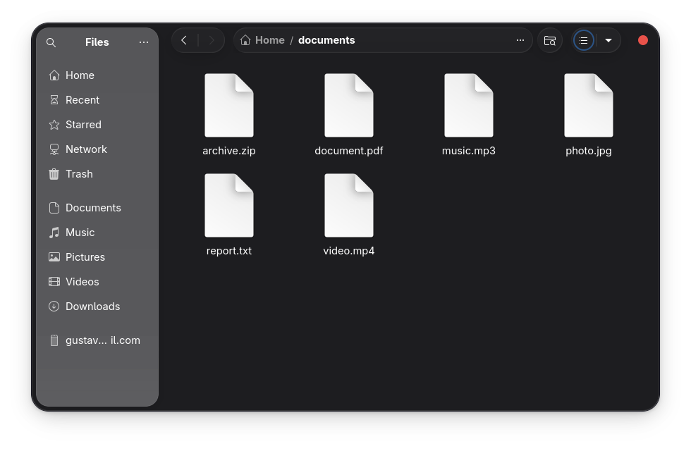
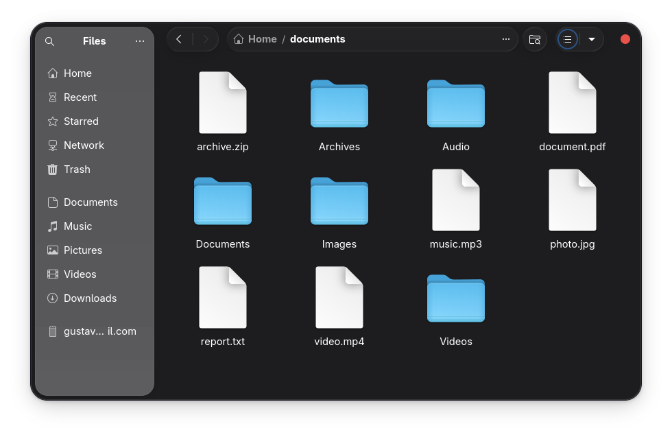
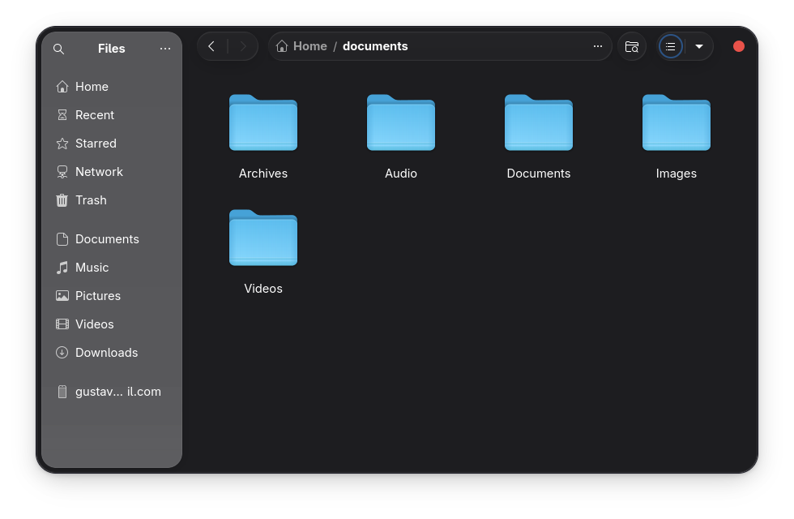

# File Organizer Bot

A simple, practical, and lightweight Python script that automatically organizes files in **any directory** into categorized subfolders (Images, Documents, Videos, Audio, Archives, Code, etc.).

Ideal for cleaning up messy Downloads, Desktop, Documents, or any other folder — with a safe **dry-run** preview mode so you never accidentally move files.

### Features
- Organizes files based on common file extensions
- Automatically creates destination folders (Images, Documents, Videos, etc.)
- Safely handles duplicate filenames (adds _1, _2, etc.)

- **Dry-run mode**: preview changes without moving any files
- Works with **any folder** on your computer (absolute paths, relative paths, or ~ shortcut)
- Clear debug output and feedback in the terminal
- No external dependencies — uses only Python standard libraries

### Demo

**Before** (messy folder with scattered files):  

**After Dry-run** (a safe organize option):

**After** (clean structure with categorized subfolders):  

### How to Run the Script

1. **Clone or download the repository**
   #### bash
   git clone https://github.com/Braz-git/file-organizer-python-bot.git
   cd file-organizer-python-bot

(Recommended) Create and activate a virtual environment
This keeps the project isolated from your system Python.

### ================ Linux / macOS: ================

#### bash
python3 -m venv venv
source venv/bin/activate

### ================ Windows (PowerShell or Command Prompt): ================

Bashpython -m venv venv
venv\Scripts\activate

After activation, you should see (venv) at the start of your terminal prompt.
Run the script

## Always start with --dry-run to preview what will happen (nothing is moved!).Safe preview examples (dry-run):

### ================ Linux / macOS ================

#### Preview Downloads folder
python main.py ~/Downloads --dry-run

#### Preview Desktop
python main.py ~/Desktop --dry-run

#### Preview a specific folder in home
python main.py /home/test_folder --dry-run

#### Folder with spaces in name (use quotes)
python main.py "~/My Messy Folder" --dry-run

### ================ Windows ================

#### Preview Downloads folder
python main.py "C:\Users\YourName\Downloads" --dry-run

#### Preview Desktop
python main.py "C:\Users\YourName\Desktop" --dry-run

#### Preview a folder in Documents
python main.py "C:\Users\YourName\Documents\Old Projects" --dry-run

#### Folder with spaces (quotes required)
python main.py "C:\Users\YourName\My Messy Folder" --dry-run

### Organize files for real (only run after confirming the preview is correct):

### ================ Linux / macOS ================

### bash
python main.py ~/Downloads
python main.py ~/Desktop
python main.py /home/test_folder
python main.py "~/My Messy Folder"

### ================ WindowsBash ================

python main.py "C:\Users\YourName\Downloads"
python main.py "C:\Users\YourName\Desktop"
python main.py "C:\Users\YourName\Documents\Old Projects"
python main.py "C:\Users\YourName\My Messy Folder"

### Deactivate the virtual environment when finished

### bash
deactivate

**Important safety notes** 

Always test with --dry-run first.
Make a backup of important folders before running without the flag.
The script only moves files (not folders) and skips non-file items.

### Built With

- Python 3.8+
- Standard libraries only: pathlib, shutil, argparse

### License

MIT License — see the LICENSE file for full details.

### About this project

Created as part of my Python automation portfolio while studying Full Stack Python (EBAC).
This is a real-world example of useful file management automation — the kind of practical script I build and customize for clients.

Want a customized version? (sort by date, generate logs, email reports, etc.)
→ Check my Fiverr gigs or send me a message!

⭐ If this helps you, please star the repository!
Questions, suggestions, or improvements? Feel free to open an issue or submit a pull request.